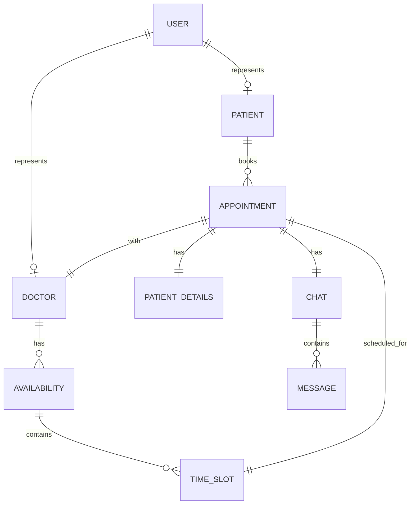

# Conceptual ERD — Schedula

This diagram represents the high-level business view of the Schedula system.

```mermaid
erDiagram
    USER
    DOCTOR
    PATIENT
    AVAILABILITY
    TIME_SLOT
    APPOINTMENT
    PATIENT_DETAILS
    CHAT
    MESSAGE

    USER ||--o| DOCTOR : represents
    USER ||--o| PATIENT : represents

    DOCTOR ||--o{ AVAILABILITY : has
    AVAILABILITY ||--o{ TIME_SLOT : contains

    PATIENT ||--o{ APPOINTMENT : books
    APPOINTMENT ||--|| DOCTOR : with
    APPOINTMENT ||--|| TIME_SLOT : scheduled_for

    APPOINTMENT ||--|| PATIENT_DETAILS : has
    APPOINTMENT ||--|| CHAT : has
    CHAT ||--o{ MESSAGE : contains
```
