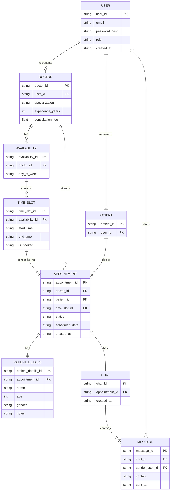

# Logical ERD — Schedula

This diagram represents the logical database design of the Schedula system.
It includes tables, attributes, primary keys, and foreign keys, independent of any specific DBMS.

